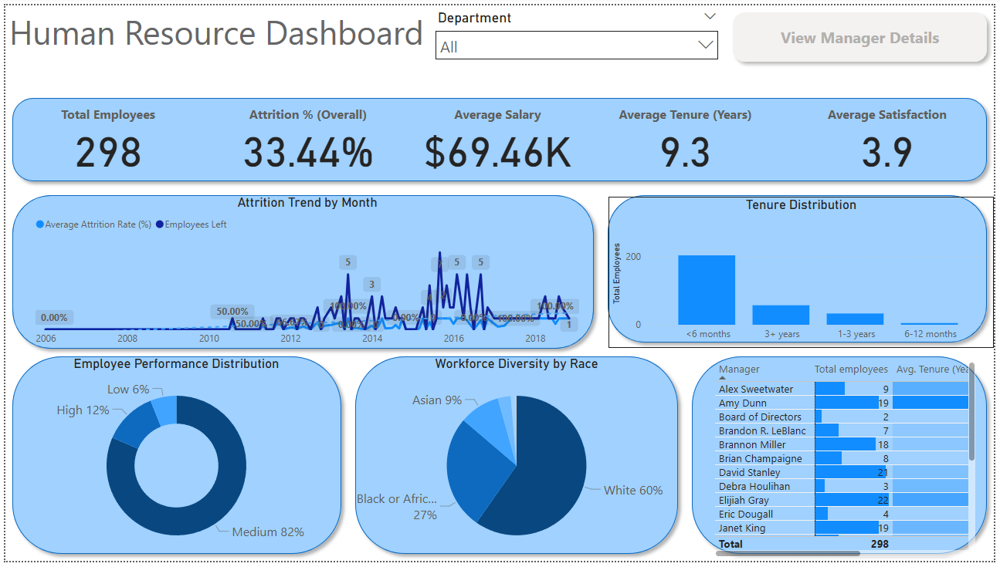
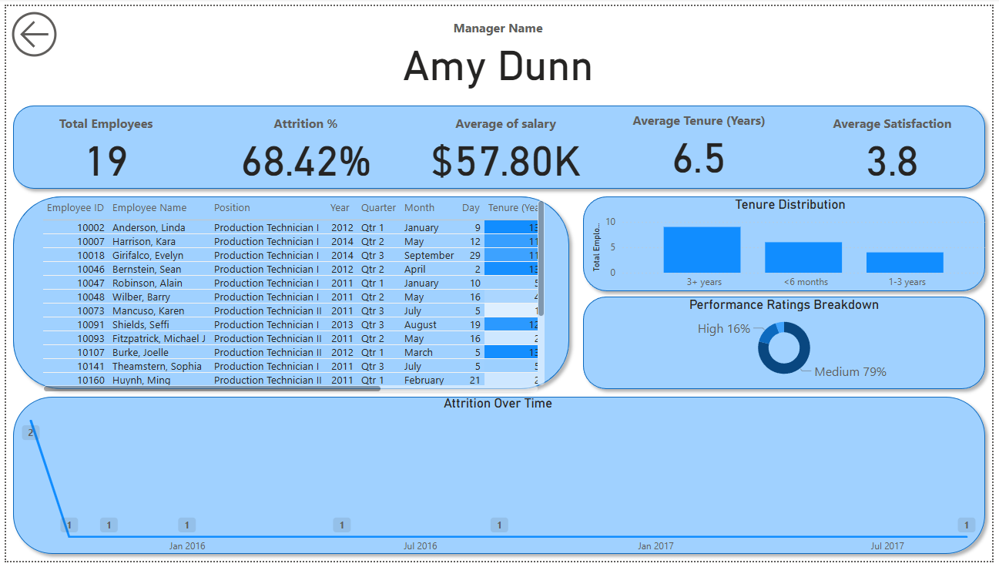

# 📊 HR Attrition Analytics & Retention Pipeline

---

## 📘 Project Background

This project presents a **realistic end-to-end HR analytics workflow**, starting from **raw employee CSVs** and progressing all the way to **automated data processing** and **Power BI visualization**.

The goal is to mirror the day-to-day responsibilities of a **People Analytics** or **HR Analyst** — cleaning and transforming raw data in **PostgreSQL**, processing it and engineering features in **Python**, and designing an **executive dashboard in Power BI** that helps analyze attrition, understand the workforce, and improve retention.

### Key KPIs (Overall)
- **Total Employees:** 298
- **Overall Attrition %:** 33.44%
- **Average Salary:** $69.46K
- **Average Tenure (Years):** 9.3
- **Average Satisfaction:** 3.9

The project revolves around two interactive dashboard pages:
1.  **HR Dashboard:** Key KPIs, attrition trends, and workforce composition.
2.  **Manager Drill-through:** Team-specific performance and retention metrics.

---

🔗 **SQL ETL Script:**
[View ETL & Schema Creation (hr_data_pipeline.sql)](https://github.com/aymaneben595/Fifth-Project/blob/688230383bbdfffb39eeec0951069618a5c42c0e/VSCode%2C%20SQL%20%26%20Python/SQL/hr_data_pipeline.sql)

🐍 **Python Processing Script:**
[View Processing & BI Export (hr_reporting_pipeline.py)](https://github.com/aymaneben595/Fifth-Project/blob/688230383bbdfffb39eeec0951069618a5c42c0e/VSCode%2C%20SQL%20%26%20Python/Python/hr_reporting_pipeline.py)

📊 **Power BI Dashboard:**
[⬇️ Download Power BI Report (HR Analytics.pbix)](https://github.com/aymaneben595/Fifth-Project/raw/688230383bbdfffb39eeec0951069618a5c42c0e/Power%20Bi/Dashboard.pbix)

---

## 🚀 Workflow Overview

The pipeline follows a **three-stage structure**, mirroring a modern data analytics workflow.

### 1️⃣ SQL: ETL & Star Schema
-   Created a dedicated `hr` schema in PostgreSQL.
-   Ingested the raw `HRDataset_v14.csv` into a `raw_employees` table.
-   Cleaned and transformed the data, using `safe_date` and `safe_numeric` functions to handle messy inputs.
-   Standardized categorical data (e.g., `performance_category`, `gender`).
-   Built a clean **star schema** consisting of one central fact table (`hr.fact_employee_clean`) and multiple dimension tables (`dim_department`, `dim_manager`, `dim_position`, `dim_race`).

### 2️⃣ Python: Feature Engineering & BI Exports
-   Loaded the clean star schema tables directly from PostgreSQL using SQLAlchemy.
-   Built an enriched `df_analytics` table by merging the fact and dimension tables.
-   Engineered key analytical features, including `tenure_bucket` ("<6 months", "1-3 years", etc.) and `event_month` for time-series analysis.
-   Created a separate `monthly_summary` aggregate table to track org-level attrition trends.
-   Exported two sets of data:
    -   `/powerbi/`: Clean, normalized star schema files (e.g., `fact_hr_clean.csv`, `dim_departments.csv`) for the dashboard.
    -   `/showcase/`: Wide, enriched tables for EDA (e.g., `hr_analytics_showcase.csv`).

### 3️⃣ Power BI: Interactive Visualization
-   Integrated the normalized fact and dimension tables from the `/powerbi/` directory.
-   Modeled the data in Power BI, creating relationships between the fact and dimension tables.
-   Built KPI cards, trend lines, and demographic charts (e.g., "Workforce Diversity by Race," "Employee Performance Distribution").
-   Configured a **drill-through** page, allowing executives to click any manager on the main dashboard to see a detailed breakdown of their specific team.

---

## 🧩 Data Pipeline Summary

The dataset, based on the **HRDataset_v14**, underwent a full transformation from a single flat file into a robust star schema.

-   **Ingestion:** Loaded raw CSV into `hr.raw_employees`.
-   **Cleaning:** Handled multi-format dates (`safe_date`), cleaned salary strings (`safe_numeric`), and standardized performance scores and gender using `CASE` statements.
-   **Dimension Building:** Created clean, distinct, and keyed dimension tables for `Department`, `Position`, `Manager`, and `Race` to reduce redundancy.
-   **Final Output:** `hr.fact_employee_clean` — a robust fact table linked via keys to the clean dimension tables, ready for BI.

---

## 📈 Executive Summary

From a workforce of **298 employees**, the company faces a significant **33.44% overall attrition rate**. The average employee satisfaction is **3.9** out of 5, and the average tenure is **9.3 years**.

| Metric | Value |
| --- | --- |
| **Total Employees** | 298 |
| **Overall Attrition %** | 33.44% |
| **Average Salary** | $69.46K |
| **Average Tenure (Years)** | 9.3 |
| **Average Satisfaction** | 3.9 |
| **Workforce Diversity (White)** | 60% |
| **Workforce Diversity (Black/Afr.Am.)** | 27% |
| **Workforce Diversity (Asian)** | 9% |

The dashboard provides a high-level view of the company's health and a drill-through for managers.

  

---

## 🔍 Insights Breakdown

### 🧭 Page 1 — Overall HR Dashboard
-   **High Attrition:** The `33.44%` rate is a major concern. The "Attrition Trend by Month" chart shows specific spikes (e.g., in 2013 and 2015-2016) that warrant further investigation.
-   **Workforce Composition:** The workforce is **60% White**, **27% Black or African American**, and **9% Asian**.
-   **Performance:** The vast majority of employees (**82%**) are rated as "Medium" performers ("Fully Meets"), with **12%** "High" and **6%** "Low".
-   **Tenure:** A large portion of the staff (approx. 200 employees) has been with the company for **<6 months**, which could indicate a retention issue with new hires or a recent hiring surge.

### ⚙️ Page 2 — Manager Drill-Through (Example: Amy Dunn)
This view allows for granular analysis of team performance and is a key feature for accountability.

-   **Amy Dunn's Team:**
    -   **Total Employees:** 19
    -   **Attrition %:** `68.42%` (This is **critically high** and more than double the company average).
    -   **Average Salary:** `$57.80K` (Significantly lower than the company average of $69.46K).
    -   **Average Satisfaction:** `3.8` (Slightly below the company average of 3.9).

  

---

## 💡 Business Recommendations

1.  **Investigate High Attrition Drivers Immediately**
    The `33.44%` overall rate is unsustainable. The first priority should be to analyze the `TermReason` column (from the raw data) against department, manager, and tenure to find the root cause.

2.  **Focus on New Hire Retention**
    The "Tenure Distribution" chart shows a massive group in the `<6 months>` bucket. The onboarding process and 30-60-90 day check-ins must be reviewed to ensure new employees are supported.

3.  **Analyze High-Attrition Managers**
    Amy Dunn's team attrition (`68.42%`) is a critical red flag. The drill-through dashboard should be used to identify other managers with similar issues. This suggests a need for targeted leadership training, intervention, or team restructuring.

4.  **Review Compensation and Satisfaction Link**
    Amy Dunn's team has both lower pay and catastrophic attrition. A company-wide pay equity analysis should be conducted, especially for the "Production Technician" roles (which make up her team) to see if compensation is a primary driver for turnover.

---

## ⚙️ Assumptions & Notes

-   Dataset sourced from the **HRDataset_v14** (as noted in the SQL script comments).
-   The SQL script creates a clean, normalized star schema, which is then loaded by Python for further processing.
-   The Python script creates two sets of outputs: one for BI (normalized) and one for EDA (wide table).
-   `dateoftermination` is used to calculate `attrition_flag` and tenure. Active employees have `CURRENT_DATE` as their end date for tenure calculations.

---

  <i>Created by Aïmane Benkhadda — End-to-End HR Analytics Project (PostgreSQL · Python · Power BI)</i> 
  <a href="mailto:aymanebenkhadda5959@gmail.com">aymanebenkhadda5959@gmail.com</a>

---

✅ **In short:**
This project combines **SQL-based ETL** (building a star schema), **Python-based data processing**, and **Power BI visualization** into one complete analytical solution — the same kind of workflow a People Analyst or Data Analyst would build to help a company understand its workforce and reduce attrition.
